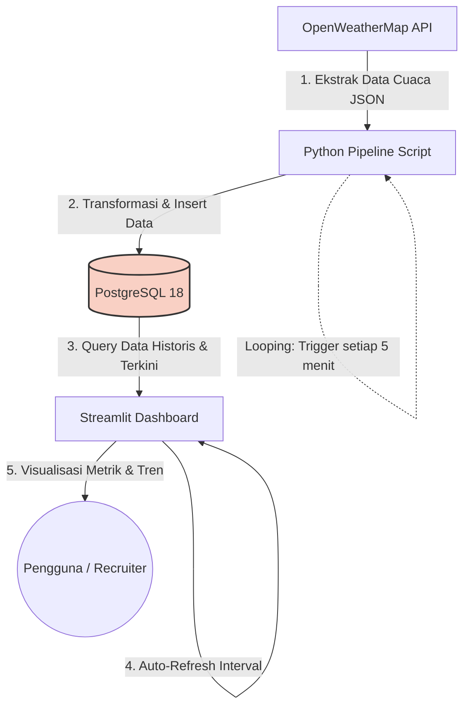

# Real-Time Weather Data Engineering & Analytics Pipeline

## 1) Judul, Latar Belakang, & Tujuan

### Judul
**Real-Time Weather Data Engineering & Analytics Pipeline**

### Latar Belakang
Cuaca adalah faktor krusial yang berdampak langsung pada operasi bisnis, terutama di sektor logistik maritim dan penerbangan (misalnya SPIL atau instansi BMKG). Pemantauan cuaca manual tidak efisien dan rawan keterlambatan informasi. Karena itu dibutuhkan sistem otomasi yang dapat menarik, menyimpan, dan menyajikan data fluktuasi cuaca secara **real-time** tanpa intervensi manusia.

### Tujuan
Membangun pipeline data otomatis **End-to-End** yang:
1. Mengekstrak data cuaca dari sumber eksternal secara periodik,
2. Memuatnya ke basis data relasional (PostgreSQL),
3. Menyajikannya melalui dashboard interaktif yang memperbarui metrik secara otomatis.

Proyek ini menunjukkan pemahaman praktis tentang **ekstraksi API**, **manajemen PostgreSQL**, dan **visualisasi frontend**.

---

## 2) Tools yang Digunakan

- **Environment & Editor:** VS Code, Mac M1 (Apple Silicon), Python 3.11 (via Miniconda `tensorflow_env`)
- **Sumber Data:** OpenWeatherMap API (JSON)
- **Backend / Orkestrasi:** Python  
  - `requests` untuk API call  
  - `schedule` untuk otomasi waktu
- **Database:** PostgreSQL 18 (native via Homebrew)
- **Frontend / UI:** Streamlit  
  - `streamlit-autorefresh` untuk simulasi live-dashboard / auto-refresh

---

## 3) Arsitektur Aplikasi (Diagram Workflow)

**Ringkas alur:**
1. **Extract:** Python mengambil JSON dari OpenWeatherMap API  
2. **Load:** Data ditransformasikan lalu di-*insert* ke PostgreSQL  
3. **Serve/Query:** Streamlit melakukan query data historis & terkini dari PostgreSQL  
4. **Refresh:** Dashboard auto-refresh sesuai interval  
5. **Consume:** User melihat metrik dan tren cuaca secara real-time

---

## 4) Testing (Skenario Pengujian)

Tujuan testing: menguji setiap titik sambung (*node*) pada arsitektur agar alur data aman dan konsisten.

1. **Test 1 (Ekstraksi)**
   - Jalankan script Python.
   - Pastikan API merespons **status `200 OK`**.
   - Pastikan struktur JSON terbaca dengan benar.

2. **Test 2 (Database Load)**
   - Pastikan koneksi `psycopg2` berhasil ke PostgreSQL.
   - Cek tabel **`cuaca_surabaya`**: pastikan baris data bertambah setelah script dieksekusi.

3. **Test 3 (Otomasi)**
   - Biarkan script berjalan **15 menit**.
   - Verifikasi ada **3 data baru** yang masuk otomatis (jika interval 5 menit).

4. **Test 4 (Visualisasi UI)**
   - Buka Streamlit di browser.
   - Pastikan grafik tren (line chart) terhubung ke data PostgreSQL.
   - Pastikan halaman auto-refresh berjalan tanpa error.

---

## 5) Evaluasi & Validasi

### Kriteria Sukses (True)
- Data cuaca **bertambah otomatis** di database tanpa intervensi.
- Grafik di Streamlit **ikut bergerak/ter-update** setiap interval.
- Tidak ada indikasi masalah performa, misalnya **kebocoran memori** (laptop M1 tetap ringan).

### Jika Gagal (False) → kembali ke tahap testing/debugging
Contoh titik pemeriksaan:
- PostgreSQL service mati?
- API key kena limit?
- Tipe data SQL tidak cocok dengan hasil transformasi (mis. dari Pandas/dataframe)?
- Error saat insert/query?
